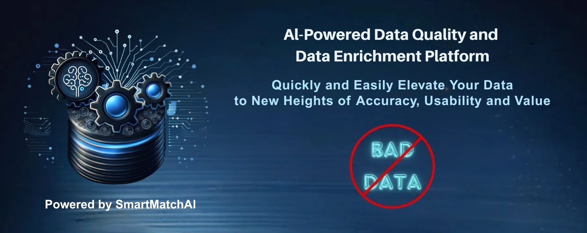

 

 

 

<b>Interzoid API Platform</b>

Interzoid is an AI-powered API platform that provides data quality, data matching, and data enrichment services to increase the consistency, reliability, and overall data ROI of critical data assets. Interzoid’s APIs allow you to match records, enrich attributes, normalize and standardize fields, and verify data across multiple domains—enabling cleaner pipelines, more accurate analytics, and higher-value operational outcomes.

This repository contains numerous code samples, tooling, and usage examples showing how to integrate and apply these APIs across a wide variety of environments. Interzoid also provides batch utilities, no-code tools, and workflow automation options for organizations that prefer to operationalize data quality and enrichment without writing code.

All APIs require an API key, which can be obtained by registering at https://www.interzoid.com. All tools and utilities are free to use as only the underlying API usage is billed (after trial API credits are exhausted).

