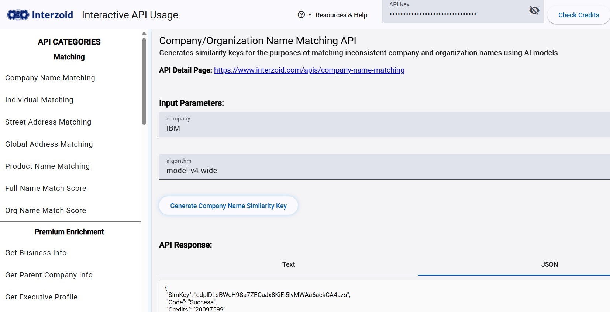
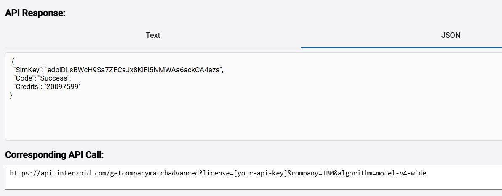

You can try our various APIs without writing code. This tool allows you to try values to invoke the API with and see the results, helping you to understand how to best put a given Interzoid API to use quickly and easily.

For a given input value that provides a result that fits your requirements, it also generates the corresponding API call for you to see. This reduces experimentation and saves you a great deal of time.

https://try.interzoid.com

 

 

 

You can generate an API call corresponding to your results to for integration and automation purposes:

 

 

 

